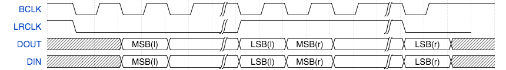
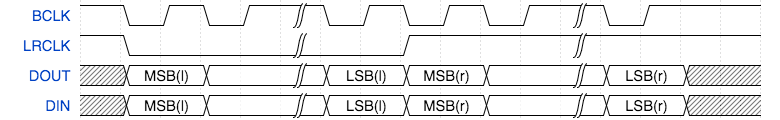
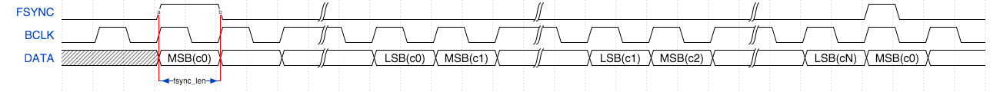
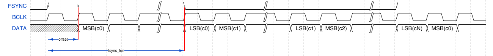
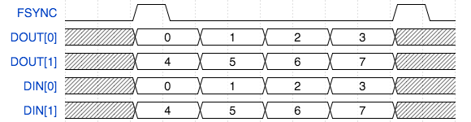

########################
lib_i2s: I2S/TDM library
########################

************
Introduction
************

``lib_i2s`` allows interfacing to I²S or TDM (Time Division Multiplexed) buses via `xcore` ports
and can act either act as I²S `controller` (previously termed `master`) or `target` (previously termed
`slave`) or TDM `controller`.

I²S and TDM are digital data streaming interfaces particularly appropriate for transmission of audio
data.

****************
I²S fundamentals
****************

I²S is a protocol between two devices where one is the *controller* (or *master*) and one is the
*target* (or *slave*) . The protocol is made up of three signals shown in :numref:`i2s_lines_table`.

.. _i2s_lines_table:

.. list-table:: I²S protocol lines
     :class: vertical-borders horizontal-borders
     :widths: 20,50

     * - *SCK*
       - Serial clock (or "bit clock"). Clock line controlling data timing. Driven by the controller.
     * - *WS*
       - Word select (or "left/right clock"). Channel synchronisation signal. Driven by the controller.
     * - *SD*
       - Serial Data, driven either the target or controller depending on the data direction.
         There may be several data lines in differing directions.

The protocol may also include additional lines shown in :numref:`i2s_additonal_lines_table`.

.. _i2s_additonal_lines_table:

.. list-table:: I²S additional lines
     :class: vertical-borders horizontal-borders
     :widths: 20,50

     * - *MCLK*
       - Master clock. (typically 256 x `WS`); not part of the standard, but is commonly included
         for synchronising the internal operation of the analog/digital converters

Key parameters of of a I²S protocol are shown in :numref:`i2s_signal_params`.

.. _i2s_signal_params:

.. list-table:: I²S configuration parameters
     :class: vertical-borders horizontal-borders
     :widths: 20,50

     * - *MCLK_BCLK_RATIO*
       - The fixed ratio between the master clock and the bit clock.
     * - *MODE*
       - The mode - the alignment of the data respective to `WS`
     * - *NUM_DATA_BITS*
       - The number of bits in a data word; this is usually 32, but can be
         adjusted to any value below 32 if required when using one bit ports for
         I/O.

I²S has several modes based on data alignment and channel configuration:

#. *Standard (Philips)*: Data is aligned with the Word Select (`WS`) signal change, commonly used with PCM audio.
#. *Left-Justified*: Data starts immediately with the `WS` change, aligning MSB (Most Significant Bit) with the `WS` transition.
#. *Right-Justified*: Data is right-aligned with the `WS`, with the LSB (Least Significant Bit) ending at the `WS` transition.

.. note::

    ``lib_i2s`` currently only supports standard" and "left-justified" modes.

The `controller` signals data transfer should occur by a transition on the *WS* (*LRCLK*) line.
In *standard* mode (shown in :numref:`i2s_standard_mode_signal`) data is transferred on the second
falling edge after the *WS* transitions.

.. _i2s_standard_mode_signal:

   I²S Mode

|newpage|

In *Left Justified Mode* (shown in :numref:`i2s_left_justified_mode_signal`) the data is transferred
on the next falling edge after the *WS* transition.

.. _i2s_left_justified_mode_signal:

   Left Justified Mode

In either case the signal multiplexes two channels of data onto one data line. When the *WS* is
low, the *left* channel is transmitted. When the *WS* is high, the *right* channel is transmitted.

All data is transmitted most significant bit first.

.. note::

    *Right Justified* mode can be attained by setting the ``lib_i2s`` to  *Left Justified* mode to
    align data to the *WS* signal and then the data should be right shifted appropriately by the
    application before being provided to ``lib_i2s``.

Resource usage
==============

The I²S and TDM modules use one hardware thread and between 1.6 and 2.1kB of memory.
There may be spare processing time available in the callbacks of I²S and TDM.
IO usage is 1 x 1b port for each signal or 4b ports for data in some cases.

Connecting I²S signals to the `xcore` device
============================================

The I²S wires need to be connected to the `xcore` device as shown in :numref:`i2s_master_xcore_connect`
and :numref:`i2s_slave_xcore_connect`.
The signals can be connected to any one bit port on the device provided that they do not overlap
any other used ports and are all on the same tile.
In addition, four bit ports may also be used to connect to up to four signals of input or output
with the same constraints as above.

.. _i2s_master_xcore_connect:

.. figure:: images/i2s_master_connect.*
   :width: 30%

   I²S connection to the `xcore` device (`xcore` as I²S `controller`)

.. _i2s_slave_xcore_connect:

.. figure:: images/i2s_slave_connect.*
   :width: 30%

   I²S connection to the `xcore` device (`xcore` as I²S target)

If only one data direction is required then the *DOUT* or *DIN* lines can be omitted.

.. warning::

    The use of four-bit ports over one-bit ports will lead to some restrictions in supported
    frequencies.

I²S controller speeds and performance
=====================================

The speed and number of data wires that can be driven by the ``lib_i2s`` running as a I²S `controller`
(master) depends on the speed of the thread that runs the code and the amount of processing that
occurs in the user callbacks for handling the data from the library.

I²S `controller` uses hardware clock dividers and an efficient callback interface to achieve high
throughputs. This also permits the use of non-32bit data word lengths if needed.
:numref:`i2s_frame_master_62_5_speeds` shows the known working configurations when using one-bit
ports for the data lines:

|beginfullwidth|

 .. _i2s_frame_master_62_5_speeds:

.. list-table:: Known working I²S controller configurations on a 62.5MHz core using one bit ports
     :class: vertical-borders horizontal-borders
     :header-rows: 1
     :widths: 15 24 11 27 10 13

     * - **MCLK FREQ (MHz)**
       - **MCLK/BCLK RATIO**
       - **DATA WORD (bits)**
       - **SAMPLE FREQ (Hz)**
       - **MAX IN (chans)**
       - **MAX OUT (chans)**
     * - 12.288
       - 32, 16, 8, 4, 2
       - 32
       - 6000 - 96000
       - 4 (8)
       - 4 (8)
     * - 24.576
       - 64, 32, 16, 8, 4, 2
       - 32
       - 6000 - 192000
       - 1 (2)
       - 1 (2)
     * - 100
       - 344
       - 24
       - 6056
       - 4 (8)
       - 4 (8)
     * - 250
       - 432, 216, 108, 52, 24
       - 24
       - 12056 - 217013
       - 4 (2)
       - 4 (2)
     * - 12.288
       - 64, 32, 16, 8, 4, 2
       - 16
       - 6000 - 192000
       - 4 (8)
       - 4 (8)
     * - 24.576
       - 128, 64, 32, 16, 8, 4
       - 16
       - 6000 - 192000
       - 1 (2)
       - 1 (2)
     * - 12.288
       - 128, 64, 32, 16, 8, 4
       - 8
       - 6000 - 192000
       - 4 (8)
       - 4 (8)
     * - 24.576
       - 256, 128, 64, 32, 16, 8
       - 8
       - 6000 - 192000
       - 1 (2)
       - 1 (2)

|endfullwidth|

:numref:`i2s_frame_master_62_5_speeds_4bit` shows the known working configurations when using
four-bit ports for the data lines:

|beginfullwidth|

.. _i2s_frame_master_62_5_speeds_4bit:

.. list-table:: Known working I²S `controller` configurations on a 62.5MHz core using four bit ports
     :class: vertical-borders horizontal-borders
     :header-rows: 1
     :widths: 15 28 7 27 10 13

     * - **MCLK FREQ (MHz)**
       - **MCLK/BCLK RATIO**
       - **DATA WORD (bits)**
       - **SAMPLE FREQ (Hz)**
       - **MAX IN (chans)**
       - **MAX OUT (chans)**
     * - 12.288
       - 32, 16, 8, 4, 2
       - 32
       - 6000 - 96000
       - 4 (8)
       - 4 (8)
     * - 24.576
       - 64, 32, 16, 8, 4, 2
       - 32
       - 6000 - 192000
       - 1 (2)
       - 1 (2)

|endfullwidth|

.. note::

    If running at higher rates such as 768 kHz, it may be necessary to modify the port timing delays
    to ensure proper sampling of the data and `WS` lines. There are methods for doing this using I/O
    pad/pin and/or sampling delays, however, this is beyond the scope of this document. Please consult
    `I/O timings for xcore-200 <https://www.xmos.com/download/I-O-timings-for-xCORE200%281.0%29.pdf>`_
    and `I/O timings for xcore.ai <https://www.xmos.com/download/xcore_ai-I-O-Timings%28F%29.pdf>`_
    for further information.

I²S target speeds and performance
=================================

The speed and number of data wires that can be driven by ``lib_i2s`` running as a target (slave)
depends on the speed of the thread that runs the code and the amount of processing that occurs in
the user callbacks for handling the data from the library.

The table :numref:`i2s_frame_slave_62_5_speeds` shows the known working configurations when using a
one-bit port.
Other configurations may be possible depending on performance:

|beginfullwidth|

.. _i2s_frame_slave_62_5_speeds:

.. list-table:: Known working I²S slave configurations on a 62.5MHz core using one bit ports
     :class: vertical-borders horizontal-borders
     :header-rows: 1
     :widths: 20 20 20 20 20

     * - **BCLK FREQ (MHz)**
       - **DATA WORD (bits)**
       - **SAMPLE FREQ (Hz)**
       - **NUM IN (num channels)**
       - **NUM OUT (num channels)**
     * - 12.288
       - 32
       - 192000
       - 4 (8)
       - 4 (8)
     * - 12.288
       - 16
       - 192000
       - 4 (8)
       - 4 (8)
     * - 12.288
       - 8
       - 192000
       - 4 (8)
       - 4 (8)

|endfullwidth|

The table :numref:`i2s_frame_slave_62_5_speeds_4bit` shows the known working configurations when
using a four-bit port.
Other configurations may be possible depending on performance:

|beginfullwidth|

.. _i2s_frame_slave_62_5_speeds_4bit:

.. list-table:: Known working I²S target configurations on a 62.5MHz core using four bit ports
     :class: vertical-borders horizontal-borders
     :header-rows: 1
     :widths: 20 20 20 20 20

     * - **BCLK FREQ (MHz)**
       - **DATA WORD**
       - **SAMPLE FREQ**
       - **NUM IN (num channels)**
       - **NUM OUT (num channels)**
     * - 12.288
       - 32
       - 192000
       - 4 (8)
       - 4 (8)

|endfullwidth|

.. note::

    A master-clock input is not required when operating as an I²S `target`

****************
TDM fundamentals
****************

I²S TDM (Inter-IC Sound Time Division Multiplexing) is a specialised protocol in digital audio
systems used for transmitting audio data. It's a combination of the I²S protocol, commonly used for
digital audio data transfer, with Time Division Multiplexing (TDM), which allows multiple audio
channels to be sent over a single data line.

It is a protocol between devices where one is the *controller* (*master*) and one or more are
the *targets* (*slaves*).

In I²S TDM mode, multiple channels (typically 8) are packed within each frame, with each channel
assigned a specific time slot. By using TDM, audio systems can reduce the number of data lines
required, consolidating multiple audio channels onto one I²S  bus.

The protocol comprises three signals:

 * Bit clock (*BCLK*)
    - The Bit Clock line provides the clock signal for each bit of data.
    - It determines the speed at which bits are transmitted across the data line.
    - Each cycle of BCLK corresponds to the transmission of one bit in the data stream.
 * Word Clock (*WS*) or Frame Sync (*FS*)
    - The Word Select (sometimes called Frame Sync) line is used to mark the beginning of each frame in TDM.
    - In standard I2S, this line is used to distinguish left and right channels. But in TDM, it signals the start of a frame that could contain multiple channels.
    - Each complete WS cycle (high and low) represents a full frame of multiple audio channels.
 * Serial Data (*SD*) or Data Line
    - The Serial Data line carries the actual audio data.
    - In TDM, this data line contains time-division multiplexed data from multiple channels within each frame, with each channel assigned a specific time slot.
    - Audio samples from each channel are transmitted sequentially in their designated slots within a frame.

Unlike I²S there is no formal specification for TDM and implementations vary between manufacturers.
The configuration of a TDM signal depends on the parameters shown in :numref:`tdm_signal_params`.
Manipulation of these values allows for compatibility with a large range of devices.

|beginfullwidth|

.. _tdm_signal_params:

.. list-table:: TDM configuration parameters
     :class: vertical-borders horizontal-borders

     * - *CHANNELS_PER_FRAME*
       - The number of channels multiplexed into a frame on the data line.
     * - *FSYNC_OFFSET*
       - The number of bits between the frame sync signal transitioning and
         data being driven on the data line(s).
     * - *FSYNC_LENGTH*
       - The number of bits that the frame sync signal stays high for
         when signaling frame start.

|endfullwidth|

:numref:`tdm_sig_1` and :numref:`tdm_sig_2` show example waveforms for TDM
with different offset and sync length values.

.. _tdm_sig_1:

   TDM signal (sync offset 0, sync length 1)

.. _tdm_sig_2:

   TDM signal (sync offset 1, sync length 32)

The `controller` signals a frame by driving the *FSYNC* signal high. After a delay of *FSYNC_OFFSET*
bits, data is driven. Data is driven most significant bit first. First, 32 bits of data from Channel
0 is driven, then 32 bits from channel 1 up to channel N (when N is *CHANNELS_PER_FRAME*).
The next frame is then signaled.

Connecting TDM signals to the `xcore` device
============================================

The TDM lines need to be connected to the `xcore` device as shown in :numref:`tdm_xcore_connect`.
The signals can be connected to any one bit ports on the device provided they do not overlap any
other used ports and are all on the same tile.

.. _tdm_xcore_connect:

.. figure:: images/tdm_connect.*
   :width: 30%

   TDM connection to the xCORE device

If only one data direction is required then the *DOUT* or *DIN* lines can be omitted.

TDM speeds and performance
==========================

The speed and number of data wires that can be driven by the I²S library running as TDM `controller`
depends on the speed of the thread that runs the code and the amount of processing that occurs in
the user callbacks for handling the data from the library. :numref:`tdm_master_62_5_speeds` show
configurations that are known to work for small amounts of callback processing.
Other speeds will be achievable depending on the amount of processing in the application and the
thread speed.

|beginfullwidth|

.. _tdm_master_62_5_speeds:

.. list-table:: Known working TDM configurations on a 62.5MHz core
     :class: vertical-borders horizontal-borders
     :header-rows: 1

     * - **BCLK FREQ (MHz)**
       - **CHANNELS PER FRAME**
       - **SAMPLE FREQ (Hz)**
       - **NUM IN (num channels)**
       - **NUM OUT (num channels)**

     * - 12.288
       - 8
       - 48000
       - 2 (16)
       - 2 (16)
     * - 6.144
       - 4
       - 48000
       - 4 (16)
       - 4 (16)

|endfullwidth|

*****
Usage
*****

``lib_i2s`` is intended to be used with `XCommon CMake <https://www.xmos.com/file/xcommon-cmake-documentation/?version=latest>`_,
the `XMOS` application build and dependency management system.

In order to use ``lib_i2s`` it needs to be added to the ``APP_DEPENDENT_MODULES`` list in the
application `CMakeLists.txt` file, for example::

    set(APP_DEPENDENT_MODULES "lib_i2s")

Applications should then include the ``i2s.h`` header file.

The callback interface
=======================

All major functions in the ``lib_i2s`` operate by controlling the I²S or TDM bus in a thread of
a `xcore` device. The library will then make callbacks to the application when it receives a frame
of samples or requires a frame of samples to send.

.. figure:: images/i2s_generic_task_diag.*

I²S `controller` usage
======================

A template application task is shown below. The specific contents of each callback will depend on
the application.

.. literalinclude:: ../../examples/app_simple_i2s_frame_master/src/simple_i2s_frame_master.xc
   :start-at: my_application
   :end-before: out buffered

The initialisation callback will provide configuration structures relevant to the communication bus
being used. The application can set the parameters of the bus (*MCLK/BCLK* ratio, *WS* alignment
etc.) at this point.

The I²S `controller` (`master`) task is instantiated as a parallel task that run in a ``par`` statement. The
application can connect via the ``i2s_frame_callback_if`` interface connection. For example,
the following code instantiates an I²S `controller` component and connects to it.

.. literalinclude:: ../../examples/app_simple_i2s_frame_master/src/simple_i2s_frame_master.xc
   :start-at: int main

I²S `target` usage
==================

The I²S `target` (`slave`) task is instantiated as a parallel task that runs in a ``par`` statement.
The application can connect via the ``i2s_frame_callback_if``  interface connection. For example,
the following code instantiates an I²S `target` component and connects to it.

.. literalinclude:: ../../examples/app_simple_i2s_frame_slave/src/simple_i2s_frame_slave.xc
   :start-at: out buffered

The `target` API has an additional configuration option to sample `SD` and `WS` on the falling
edge of bit clock, instead of rising edge. Data is then output on rising edge instead of falling
edge. This option is useful with non-standard `controllers` that invert their bit clock.

*********
TDM usage
*********

The TDM `controller` task is instantiated as a parallel task that runs in a ``par`` statement.
The application can connect via the ``tdm_callback_if``  interface connection. For example,
the following code instantiates a TDM `controller` component and connects to it.

.. literalinclude:: ../../examples/app_simple_tdm_master/src/simple_tdm_master.xc
   :start-at: out buffered

.. _i2s_channel_map:

The callback interface for TDM numbers the channels being sent/received for the send and receive
callbacks. There is a fixed mapping from these channel indices to the physical interface being used.

TDM channel numbering
=====================

The data words within TDM frames are assigned sequentially from the start of the frame. Each data
line will have its channel numbers assigned in the order that the ports are provided in the data in
and data out array arguments to the component.

For example, a system with 2 data out ports and 2 data in ports is declared as::

  out buffered port:32 p_dout[2] = {XS1_PORT_1A, XS1_PORT_1B};
  in buffered port:32 p_din[2] = {XS1_PORT_1E, XS1_PORT_1F};

With the number of channels per frame as 4, the samples will be
numbered as indicated in :numref:`tdm_chan_diag`:

.. _tdm_chan_diag:

   TDM channel numbering

******************
Callback sequences
******************

The I²S implementations have a simple sequence. :numref:`i2s_frame_callback_seq` shows an example sequence.

.. _i2s_frame_callback_seq:

.. list-table:: Frame-based I²S callback sequence

 * - Initial send:
   - Init, Send All
 * - Frame:
   - Restart check, Send All, Receive All
 * - Frame:
   - Restart check, Send All, Receive All
 * - ...
   - ...
 * - Frame:
   - Restart check, Send All, Receive All
 * - Final receive:
   - Restart check (I2S_RESTART), Receive All

When using TDM, the receive callbacks for a channel occur after the
send callbacks. The receive callback for the last channel of the frame
will occur after the send callback for the next frame. After a restart
request a tail of receive callbacks for the last channel of the final
frame will occur. :numref:`tdm_callback_seq` shows an example TDM
callback sequence for two data lines in and out with four channels per
frame.

.. _tdm_callback_seq:

.. list-table:: Sample TDM callback sequence

  * - S0 S4 S1 S5 R0 R4 S2 S6 R1 R5 S3 S7 R2 R6
  * - S0 S4 R3 R7 S1 S5 R0 R4 S2 S6 R1 R5 S3 S7 R2 R6
  * - ...
  * - S0 S4 R3 R7 S1 S5 R0 R4 S2 S6 R1 R5 S3 S7 R2 R6
  * - S0 S4 R3 R7 S1 S5 R0 R4 S2 S6 R1 R5 S3 S7 R2 R6
  * - R3 R7

In both cases the components attempt to distribute the calling of the callbacks
evenly within the frame to allow processing to occur throughout the
frame evenly.

The ``restart_check`` callback is called once per frame to allow the
application to request a restart/shutdown of the data bus.

Clock configuration
===================

For the TDM components it is the application's
responsibility to set up and start the internal clock used for the master clock
before calling the component.

For example, the following code configures a clock to be based
of an incoming data wire and starts the clock::

    configure_clock_src(mclk, p_mclk);
    start_clock(mclk);

For more information on configuring clocks see the `XMOS XTC tools user guide <https://www.xmos.com/documentation/XM-014363-PC/html/tools-guide/index.html>`_

********
Examples
********

Various example example applications are provided along side the ``lib_i2s`` that demonstrate basic
usage.
These are located in the ``examples`` directory.

**************
Loopback demos
**************

Two fully fledged demonstration applications are included in the accompanying examples that
implement an audio loopback using I²S.
One where `xcore` operates as a `controller` (or `master`) and another where the `xcore` operates
as a `target` (or `slave`).
These are ``app_i2s_frame_loopback_demo`` and ``app_i2s_frame_slave_loopback_demo`` respectively.

These example applications run on the `XMOS XU316 Multichannel Audio board` (`XK-AUDIO-316-MC`).

This section documents ``app_i2s_frame_loopback`` in detail, however, much of the detail is shared
with ``app_i2s_frame_slave_loopback_demo``.

Block diagram
=============

.. figure:: images/loopback_block_diagram.drawio.*
   :width: 60%

   Application block diagram

The main application fits within one thread with an additional remote I²C task to allow the audio
hardware to be configured remotely from the other tile. This required due to the IO arrangement of
the `XK-AUDIO-316-MC` board.

A board support library, `lib_board_support <www.xmos.com/file/lib_board_support>`_, provides the
code to configure the external audio DACs and ADCs of the `XK-AUDIO-316-MC` board.

.. note::

   ``lib_board_support`` has the I²C library (`lib_i2c <www.xmos.com/file/lib_i2c>`_) in its
   dependency list.

The I²S task calls back to the ``i2s_loopback`` task and the processing in the ``i2s_loopback``
task is performed in-between the I/O operations of I²S.

Application `CMakeLists.txt`
============================

In order for the application to use ``lib_i2s`` it is added to the application `CMakeLists.txt`
file. As previously described, the demonstration applications also use ``lib_board_support``, so
that is also listed::

  set(APP_DEPENDENT_MODULES     "lib_i2s"
                                "lib_board_support")

.. note::

   To ensure consistency of dependencies between examples, all example applications share
   a dependency list in a `deps.cmake` file located in the root of ``examples``

Includes
========

Applications typically need to include ``platform.h`` and ``xs1.h`` to gain access to `xcore` specific
defines and functions. These are provided as part of the `XMOS` XTC tools.

.. literalinclude:: ../../examples/app_i2s_frame_loopback_demo/src/main.xc
   :start-at: include <platform.h>
   :end-at: include <xs1.h>

``lib_i2s`` functions and types are defined in ``i2s.h``, which is included by the applications.
A relevant header file from ``lib_board_support`` is also included.

.. literalinclude:: ../../examples/app_i2s_frame_loopback_demo/src/main.xc
   :start-at: include "i2s.h"
   :end-at: include "xk_audio_316_mc_ab/board.h"

Allocating hardware resources
=============================

An I²S interface requires both clock and data pins in order to communicate with the external audio
hardware devices.

The ports used by the ``lib_i2s`` are declared on the tile they reside and with their
direction and buffered nature. The loopback application use four 1-bit ports for data input and four
more for data output:

.. literalinclude:: ../../examples/app_i2s_frame_loopback_demo/src/main.xc
   :start-at: on tile[1]: in port p_mclk
   :end-at: on tile[1]: buffered in port:32 p_adc[NUM_I2S_LINES]

The `xcore` also provides ``clock block`` hardware to efficiently generate clock signal that can
either be driven out on a port or used to control a port. In the loopback applications one clock
block is used:

.. literalinclude:: ../../examples/app_i2s_frame_loopback_demo/src/main.xc
   :start-at: on tile[1]: clock bclk
   :end-at: on tile[1]: clock bclk

The application main() function
===============================

The ``main()`` function in the program sets up the tasks in the application.

Firstly, the ``interfaces`` are declared. In `XC` interfaces provide a means of concurrent tasks
communicating with each other. In the loopback applications there is an interface for I²S:

.. literalinclude:: ../../examples/app_i2s_frame_loopback_demo/src/main.xc
   :start-at: interface i2s_frame_callback_if i_i2s;
   :end-at: interface i2s_frame_callback_if i_i2s;

and another interface for I²C:

.. literalinclude:: ../../examples/app_i2s_frame_loopback_demo/src/main.xc
   :start-at: interface i2c_master_if i_i2c[1]
   :end-at: interface i2c_master_if i_i2c[1]

The rest of the ``main`` function starts all the tasks in parallel using the `XC` ``par`` construct:

.. literalinclude:: ../../examples/app_i2s_frame_loopback_demo/src/main.xc
   :start-at: par {
   :end-before: return 0

This code starts the I²S `controller`, the I²C master, the GPIO control and the loopback
application task.

Before the I²S `controller` runs, the system configuration is run and the master clock is connected
from the input port to the clock block and then started.
The I²S `controller` task then starts and consumes a thread on the `xcore` device.

The remaining ``i2s_loopback`` task in the ``par`` is marked with the ``[[distribute]]`` attribute.
This means they will run on an existing thread if possible. In this case they will all share the
one a thread with ``i2s_frame_master()``.

Configuring audio hardware
==========================

All of the external audio hardware is configured using ``lib_board_support``.
The hardware targeted is the `XMOS XU316 Multichannel Audio board` (`XK-AUDIO-316-MC`).
The following lines deal with initialisation, I²C task start and configuration::

    xk_audio_316_mc_ab_board_setup(hw_config); // Setup must be done on tile[0]
    xk_audio_316_mc_ab_i2c_master(i_i2c);      // Run I2C master server task to allow control from tile[1]

and::

    xk_audio_316_mc_ab_AudioHwInit(i_i2c, hw_config);
    xk_audio_316_mc_ab_AudioHwConfig(i_i2c, hw_config, SAMPLE_FREQUENCY, MASTER_CLOCK_FREQUENCY, 0, DATA_BITS, DATA_BITS);

The hardware configuration is set by ``hw_config`` which in this configuration sets up the `xcore`
to be an I²S `controller` with the following settings:

.. literalinclude:: ../../examples/app_i2s_frame_loopback_demo/src/main.xc
   :start-at: #define SAMPLE_FREQUENCY
   :end-at: #define NUM_I2S_LINES

See ``lib_board_support`` documentation for further details and API details.

The i2s_loopback task
=====================

The I²S loopback task (``i2s_loopback()``) provides the function of a digital loopback such that all
samples received by the device will looped back out unmodified.

The task itself is declared as a ``[[distributable]]`` function ensuring that it can share a thread
with other tasks.

The ``i2s_loopback()`` function is listed below.

.. literalinclude:: ../../examples/app_i2s_frame_loopback_demo/src/main.xc
   :start-at: [[distributable]]
   :end-before: int main

The interface to the I²S `controller` is a callback interface that the I²S `controller` will call
over when it has received a frame data or requires a frame of data to send.

The I²C interface is used to configure the external audio hardware.

The body of the loopback task handles the I²S interface calls.

The I²S `controller` library calls the ``init()`` method before it starts any data streaming. This allows
the application to reset and configure audio hardware, for example when the sample rate changes.

The ``receive()`` interface method is called when the `controller` has received a frame of audio samples
(all channels in one sample period). The samples are then store  in the ``samples`` array.

The ``send()`` interface method is called when the `controller` needs a new frame of samples to send. In
this case the application simply returns the frame of samples previously received.

Finally, the ``restart_check()`` method is called by the I²S `controller` once per frame and allows the
application to control restart or shutdown of the I²S `controller`. In this case the application continues
to run "forever" and so always returns ``I2S_NO_RESTART``.

Running the examples
====================

Building
--------

The following section assumes that the `XMOS XTC tools <https://www.xmos.com/software-tools/>`_ has
been download and installed (see `README` for required version).

Installation instructions can be found `here <https://xmos.com/xtc-install-guide>`_. Particular
attention should be paid to the section `Installation of required third-party tools
<https://www.xmos.com/documentation/XM-014363-PC-10/html/installation/install-configure/install-tools/install_prerequisites.html>`_.

The application uses the `XMOS` build and dependency system, `xcommon-cmake <https://www.xmos.com/file/xcommon-cmake-documentation/?version=latest>`_. `xcommon-cmake` is bundled with the `XMOS` XTC tools.

To configure the build run the following from an XTC command prompt::

    cd examples
    cd app_i2s_frame_loopback_demo
    cmake -G "Unix Makefiles" -B build

Any missing dependencies will be downloaded by the build system at this configure step.

Finally, the application binaries can be built using ``xmake``::

    xmake -j -C build

The application uses approximately 3 kB on Tile[0] and 7 kB on Tile[1] of 512 kB on each.

Hardware setup
--------------

 * Connect a USB cable from a host computer to the DEBUG connector.
 * Connect a USB cable from a host computer to the USB DEVICE connector.
 * Connect a sound source to the 3.5mm line in. Channels 1-2, 3-4, 5-6 or 7-8 can be used.
 * Connect powered speakers to the corresponding line out.

Running the application
-----------------------

To run the application return to the ``/examples/app_i2s_frame_loopback_demo`` directory and run
the following command::

    xrun bin/app_i2s_frame_loopback_demo.xe

Audio presented on the analog input jacks will be looped back and audible on a speaker connected the
output jacks.

|newpage|

***
API
***

Supporting types
================

.. doxygenenum:: i2s_mode_t

.. doxygenstruct:: i2s_config_t

.. doxygenstruct:: tdm_config_t

.. doxygenenum:: i2s_restart_t

|newpage|

The I²S callback interface
==========================

.. doxygengroup:: i2s_frame_callback_if

|newpage|

The I²S task instances
======================

.. doxygenfunction:: i2s_frame_master

|newpage|

.. doxygenfunction:: i2s_frame_master_4b

|newpage|

.. doxygenfunction:: i2s_frame_master_external_clock

|newpage|

.. doxygenfunction:: i2s_frame_master_external_clock_4b

|newpage|

.. doxygenfunction:: i2s_frame_slave

|newpage|

.. doxygenfunction:: i2s_frame_slave_4b

|newpage|

The TDM callback interface
==========================

.. doxygengroup:: tdm_callback_if

|newpage|

The TDM task instances
======================

.. doxygenfunction:: tdm_master

***************
Further reading
***************

 * `XMOS` tools user guide

   https://www.xmos.com/documentation/XM-014363-PC-9/html/

 * `XMOS` `xcore` programming guide

   https://www.xmos.com/published/xmos-programming-guide

 * `xcommon-cmake` build and dependency management system

   https://www.xmos.com/documentation/XM-015090-PC/html/

 * I²S bus specification

   https://www.nxp.com/docs/en/user-manual/UM11732.pdf

 * xcore.ai Multichannel Audio Platform hardware manual

   https://www.xmos.com/file/xcore_ai-multichannel-audio-platform-1v1-hardware-manual/?version=latest

