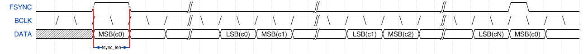

.. include:: ../../../README.rst

External signal description
---------------------------

|I2S|
.....

|I2S| is a protocol between two devices where one is the *master* and
one is the *slave* . The protocol is made up of four signals shown
in :ref:`i2s_wire_table`.

.. _i2s_wire_table:

.. list-table:: |I2S| data wires
     :class: vertical-borders horizontal-borders

     * - *MCLK*
       - Clock line, driven by external oscillator
     * - *BCLK*
       - Bit clock. This is a fixed divide of the *MCLK* and is driven
         by the master.
     * - *LRCLK* (or *WCLK*)
       - Word clock (or word select). This is driven by the master.
     * - *DATA*
       - Data line, driven by one of the slave or master depending on
         the data direction. There may be several data lines in
         differing directions.

The configuration of an |I2S| signal depends on the parameters shown
in :ref:`i2s_signal_params`.

.. _i2s_signal_params:

.. list-table:: |I2S| configuration parameters
     :class: vertical-borders horizontal-borders

     * - *MCLK_BCLK_RATIO*
       - The fixed ratio between the master clock and the bit clock.
     * - *MODE*
       - The mode - either |I2S| or left justified.
     * - *NUM_DATA_BITS*
       - The number of bits in a data word; this is usually 32, but can be 
         adjusted for legacy applications.

The *MCLK_BCLK_RATIO* should be such that twice the number of data bits can be 
output by the bit clock at the data rate of the |I2S| signal. For example, a
24.576MHz master clock with a ratio of 8 gives a bit clock at
3.072MHz. This bit clock can output 64 bits at a frequency of 48kHz -
which with a data word bit length of 32 is the underlying rate of the data.

The master signals data transfer should occur by a transition on the
*LRCLK* wire. There are two supported modes for |I2S|. In *I2S mode*
(shown in :ref:`i2s_i2s_mode_signal`) data is transferred on the
second falling edge after the *LRCLK* transitions.

.. _i2s_i2s_mode_signal:

.. figure:: images/i2s_mode.png
   :width: 100%

   |I2S| Mode

|newpage|

In *Left Justified Mode* (shown in :ref:`i2s_left_justified_mode_signal`) the
data is transferred on the next falling edge after the *LRCLK*
transition.

.. _i2s_left_justified_mode_signal:

.. figure:: images/left_justified_mode.png
   :width: 100%

   Left Justified Mode

In either case the signal multiplexes two channels of data onto one
data line. When the *LRCLK* is low, the *left* channel is
transmitted. When the *LRCLK* is high, the *right* channel is
transmitted.

All data is transmitted most significant bit first. How the
data is aligned is expected to be done in software by the
application. For example, some audio CODECs have a *Right Justified*
mode; to attain this mode the library should be set to
*Left Justified* mode to align the *LRCLK* signal and then the data
should be right shifted by the application before being passed to the
library.

Connecting |I2S| signals to the xCORE device
~~~~~~~~~~~~~~~~~~~~~~~~~~~~~~~~~~~~~~~~~~~~

The |I2S| wires need to be connected to the xCORE device as shown in
:ref:`i2s_master_xcore_connect` and :ref:`i2s_slave_xcore_connect`. The signals 
can be connected to any one bit ports on the device provide they do not overlap 
any other used ports and are all on the same tile.

.. _i2s_master_xcore_connect:

.. figure:: images/i2s_master_connect.*
   :width: 30%

   |I2S| connection to the xCORE device (xCORE as |I2S| master)

.. _i2s_slave_xcore_connect:

.. figure:: images/i2s_slave_connect.*
   :width: 30%

   |I2S| connection to the xCORE device (xCORE as |I2S| slave)

If only one data direction is required then the *DOUT* or *DIN* lines
need not be connected.

|newpage|

|I2S| master speeds and performance
~~~~~~~~~~~~~~~~~~~~~~~~~~~~~~~~~~~

The speed and number of data wires that can be driven by the |I2S|
library running as |I2S| master
depends on the speed of the logical core that runs the code
and the amount of processing that occurs in the user callbacks for
handling the data from the library. :ref:`i2s_master_62_5_speeds` shows 
configurations that are known to work for small amounts of callback processing. 
Other speeds will be achievable depending on the amount of processing in the 
application and the logical core speed.

.. _i2s_master_62_5_speeds:

.. list-table:: Known working |I2S| master configurations on a 62.5MHz core
    :class: vertical-borders horizontal-borders
    :header-rows: 1
    :widths: 15 15 15 25 30

    * - **MCLK FREQ**
      - **MCLK/BCLK RATIO**
      - **SAMPLE FREQ**
      - **MAX NUM IN (max num channels)**
      - **MAX NUM OUT (max num channels)**
    * - 12.288 MHz
      - 16
      - 12000 Hz
      - 4 (8)
      - 4 (8)
    * - 12.288 MHz
      - 8
      - 24000 Hz
      - 4 (8)
      - 4 (8)
    * - 12.288 MHz
      - 4
      - 48000 Hz
      - 4 (8)
      - 4 (8)
    * - 12.288 MHz
      - 2
      - 96000 Hz
      - 4 (8)
      - 4 (8)
    * - 24.576 MHz
      - 16
      - 24000 Hz
      - 1 (2)
      - 1 (2)
    * - 24.576 MHz
      - 8
      - 48000 Hz
      - 1 (2)
      - 1 (2)
    * - 24.576 MHz
      - 2
      - 192000 Hz
      - 1 (2)
      - 1 (2)

On the xCORE-200 the frame-based |I2S| master can be used. This uses hardware
clock dividers only available in the the xCORE-200 and a more efficient callback
interface to achieve much higher throughputs. This also permits the use of 
non-32bit data word lengths. :ref:`i2s_frame_master_62_5_speeds` shows the known
working configurations:

.. _i2s_frame_master_62_5_speeds:

.. list-table:: Known working |I2S| frame-based master configurations on a 62.5MHz core
     :class: vertical-borders horizontal-borders
     :header-rows: 1
     :widths: 15 28 7 27 10 13

     * - **MCLK FREQ**
       - **MCLK/BCLK RATIO**
       - **DATA WORD**
       - **SAMPLE FREQ**
       - **MAX IN (chans)**
       - **MAX OUT (chans)**
     * - 12.288 MHz
       - 32, 16, 8, 4, 2
       - 32 bit
       - 6000 Hz - 96000 Hz
       - 4 (8)
       - 4 (8)
     * - 24.576 MHz
       - 64, 32, 16, 8, 4, 2
       - 32 bit
       - 6000 Hz - 192000 Hz
       - 1 (2)
       - 1 (2)
     * - 100 MHz
       - 344
       - 24 bit
       - 6056 Hz
       - 4 (8)
       - 4 (8)
     * - 250 MHz
       - 432, 216, 108, 52, 24
       - 24 bit
       - 12056 Hz - 217013 Hz
       - 4 (2)
       - 4 (2)
     * - 12.288 MHz
       - 64, 32, 16, 8, 4, 2
       - 16 bit
       - 6000 Hz - 192000 Hz
       - 4 (8)
       - 4 (8)
     * - 24.576 MHz
       - 128, 64, 32, 16, 8, 4
       - 16 bit
       - 6000 Hz - 192000 Hz
       - 1 (2)
       - 1 (2)
     * - 12.288 MHz
       - 128, 64, 32, 16, 8, 4
       - 8 bit
       - 6000 Hz - 192000 Hz
       - 4 (8)
       - 4 (8)
     * - 24.576 MHz
       - 256, 128, 64, 32, 16, 8
       - 8 bit
       - 6000 Hz - 192000 Hz
       - 1 (2)
       - 1 (2)

|I2S| slave speeds and performance
~~~~~~~~~~~~~~~~~~~~~~~~~~~~~~~~~~

The speed and number of data wires that can be driven by the |I2S|
library running as slave depends on the speed of the logical core
that runs the code
and the amount of processing that occurs in the user callbacks for
handling the data from the library. :ref:`i2s_slave_62_5_speeds`
shows configurations that are known to
work for small amounts of callback processing. Other speeds will be
achievable depending on the amount of processing in the application
and the logical core speed. Note that the when acting as slave the
performance of the library only depends on the bit clock frequency,
not the underlying master clock frequency.

.. _i2s_slave_62_5_speeds:

.. list-table:: Known working |I2S| slave configurations on a 62.5MHz core
     :class: vertical-borders horizontal-borders
     :header-rows: 1

     * - **BCLK FREQ**
       - **SAMPLE FREQ**
       - **NUM IN (num channels)**
       - **NUM OUT (num channels)**
     * - 12.288MHz
       - 192000
       - 4 (8)
       - 4 (8)

Frame-based |I2S| master can be used. This uses a more efficient callback
interface to achieve much higher throughputs by transferring a frame (all channels in one sample period)
at a time and re-ordered callbacks and I/O operations so that maximum back pressure tolerance is achieved.
The table :ref:`i2s_frame_slave_62_5_speeds` shows the known working configurations. Other configurations may be possible depending on performance:

.. _i2s_frame_slave_62_5_speeds:

.. list-table:: Known working |I2S| frame-based master configurations on a 62.5MHz core
     :class: vertical-borders horizontal-borders
     :header-rows: 1
     :widths: 20 20 20 20 20

     * - **BCLK FREQ**
       - **DATA WORD**
       - **SAMPLE FREQ**
       - **NUM IN (num channels)**
       - **NUM OUT (num channels)**
     * - 12.288MHz
       - 32 bit
       - 192000
       - 4 (8)
       - 4 (8)
     * - 12.288MHz
       - 16 bit
       - 192000
       - 4 (8)
       - 4 (8)
     * - 12.288MHz
       - 8 bit
       - 192000
       - 4 (8)
       - 4 (8)

.. tip::
   |I2S| "frame-master" is capable of running at higher rates such as 768kHz within a 62.5MIPS logical core. However, it may be necessary to modify the port timing delays to ensure proper sampling of the data and LRCLK lines. There are methods for doing this using pad and/or sample delays however this is beyond the scope of this document. Please consult `I/O timings for xCORE200` available on xmos.com for further information. 

|newpage|

TDM
...

TDM is a protocol that multiplexes several signals onto one wire.
It is a protocol between two devices where one is the *master* and
one is the *slave* . The protocol is made up of three signals shown
in :ref:`tdm_wire_table`.

.. _tdm_wire_table:

.. list-table:: TDM data wires
     :class: vertical-borders horizontal-borders

     * - *BCLK*
       - Bit clock line, driven by external oscillator.
     * - *FSYNC*
       - The frame sync line. This is driven by the master.
     * - *DATA*
       - Data line, driven by one of the slave or master depending on
         the data direction. There may be several data lines in
         differing directions.

Unlike |I2S|, the bit clock is not a divide of an underlying master
clock.

The configuration of a TDM signal depends on the parameters shown
in :ref:`tdm_signal_params`.

.. _tdm_signal_params:

.. list-table:: TDM configuration parameters
     :class: vertical-borders horizontal-borders

     * - *CHANNELS_PER_FRAME*
       - The number of channels multiplexed into a frame on the data line.
     * - *FSYNC_OFFSET*
       - The number of bits between the frame sync signal transitioning and
         data being drive on the data line.
     * - *FSYNC_LENGTH*
       - The number of bits that the frame sync signal stays high for
         when signaling frame start.

:ref:`tdm_sig_1` and :ref:`tdm_sig_2` show example waveforms for TDM
with different offset and sync length values.

.. _tdm_sig_1:

   TDM signal (sync offset 0, sync length 1)

.. _tdm_sig_2:

.. figure:: images/tdm_sig_2.png
   :width: 100%

   TDM signal (sync offset 1, sync length 32)

The master signals a frame by driving the *FSYNC* signal high. After a
delay of *FSYNC_OFFSET* bits, data is driven. Data is driven most
significant bit first. First, 32 bits of data from Channel 0 is
driven, then 32 bits from channel 1 up to channel N (when N is the
number of channels per frame). The next frame is then signaled (there
is no padding between frames).

|newpage|

Connecting TDM signals to the xCORE device
~~~~~~~~~~~~~~~~~~~~~~~~~~~~~~~~~~~~~~~~~~
The TDM wires need to be connected to the xCORE device as shown in
:ref:`tdm_xcore_connect`. The signals can be connected to any
one bit ports on the device provide they do not overlap any other used
ports and are all on the same tile.

.. _tdm_xcore_connect:

.. figure:: images/tdm_connect.*
   :width: 30%

   TDM connection to the xCORE device

If only one data direction is required then the *DOUT* or *DIN* lines
need not be connected.

TDM speeds and performance
~~~~~~~~~~~~~~~~~~~~~~~~~~

The speed and number of data wires that can be driven by the |I2S|
library running as TDM master
depends on the speed of the logical core that runs the code
and the amount of processing that occurs in the user callbacks for
handling the data from the library. :ref:`tdm_master_62_5_speeds`
show configurations that are known to
work for small amounts of callback processing. Other speeds will be
achievable depending on the amount of processing in the application
and the logical core speed.

.. _tdm_master_62_5_speeds:

.. list-table:: Known working TDM configurations on a 62.5MHz core
     :class: vertical-borders horizontal-borders
     :header-rows: 1

     * - **BCLK FREQ**
       - **CHANNELS PER FRAME**
       - **SAMPLE FREQ**
       - **NUM IN (num channels)**
       - **NUM OUT (num channels)**

     * - 12.288MHz
       - 8
       - 48000
       - 2 (16)
       - 2 (16)
     * - 6.144MHz
       - 4
       - 48000
       - 4 (16)
       - 4 (16)

|newpage|

Usage
-----

All |I2S| functions can be accessed via the ``i2s.h`` header::

  #include <i2s.h>

You will also have to add ``lib_i2s`` to the
``USED_MODULES`` field of your application Makefile.

The |I2S| callback interface
............................

All major functions in the |I2S| library work by controlling the |I2S|
or TDM bus on its own logical core on an xCORE device. The library
will then make callbacks to the application when it receives a sample
or needs to send a sample.

.. figure:: images/i2s_generic_task_diag.*

   |I2S| callback usage

The callbacks are implemented by the application providing a task
which receives requests on the ``i2s_callback_if`` xC interface. The
application tasks can run the callbacks on the same logical core by
implementing a *distributable* task. More information on interfaces
and tasks can be be found
in the  :ref:`XMOS Programming Guide<programming_guide>`.

A template application task is shown below. The specific contents of
each callback will depend on the application.

.. literalinclude:: simple_i2s_master.xc
   :start-on: [[distributable]]
   :end-before: out buffered

The send/receive callbacks pass a channel index parameter to the
application. This channel maps to the data signals as shown in
:ref:`i2s_channel_map`.

The initialization callback will provide configuration structures
relevant to the communication bus being used.
The application can set the parameters
of the bus (*MCLK/BCLK* ratio, *LRCLK* alignment etc.) at this point.

|I2S| frame-based master usage
..............................

The |I2S| frame-based master task (only supported on xCORE-200) is
instantiated as a parallel task that run in a ``par`` statement. The application
can connect via the ``i2s_frame_callback_if`` interface connection. For example,
the following code instantiates an |I2S| frame-based master component and
connects to it.

.. literalinclude:: simple_i2s_frame_master.xc
   :start-on: out buffered
   :end-before: // end

|I2S| master usage
..................

The |I2S| master task is instantiated as a parallel task that run in a
``par`` statement. The application can connect via the
``i2s_callback_if``  interface connection. For example,
the following code instantiates an |I2S| master component and connects to it.

.. literalinclude:: simple_i2s_master.xc
   :start-on: out buffered
   :end-before: // end

|I2S| frame-based slave usage
.............................

The |I2S| frame slave task is instantiated as a parallel task that run in a
``par`` statement. The application can connect via the
``i2s_frame_callback_if``  interface connection. For example,
the following code instantiates an |I2S| slave component and connects to it.

.. literalinclude:: simple_i2s_frame_slave.xc
   :start-on: out buffered
   :end-before: // end

|I2S| slave usage
.................

The |I2S| slave task is instantiated as a parallel task that run in a
``par`` statement. The application can connect via the
``i2s_callback_if``  interface connection. For example,
the following code instantiates an |I2S| slave component and connects to it.

.. literalinclude:: simple_i2s_slave.xc
   :start-on: out buffered
   :end-before: // end

Slave has an additional config option to sample data and word clock on falling
edge of bit clock, instead of rising edge. Data is then output on rising edge
instead of falling edge. This option is useful with non-standard masters that
invert their bit clock.

TDM usage
.........

The TDM master task is instantiated as a parallel task that run in a
``par`` statement. The application can connect via the
``i2s_callback_if``  interface connection. For example,
the following code instantiates an TDM master component and connects to it.

.. literalinclude:: simple_tdm_master.xc
   :start-on: out buffered
   :end-before: // end

.. _i2s_channel_map:

Channel numbering
.................

The callback interface numbers the channels being sent/received for
the send and receive callbacks. There is a fixed mapping from these
channel indices to the physical interface begin used.

|I2S| channel numbering
~~~~~~~~~~~~~~~~~~~~~~~

The data words within |I2S| frames have even channel numbers
assigned to the left samples (first within the frame)
and odd numbers assigned to the right (second within the frame)
samples.

The actual sample number will be given with respect to the order that
the ports are provided in the data in and data out array
arguments to the component.

For example, in a system with 4 data out ports and 4 data in ports declared as::

  out buffered port:32 p_dout[4] = {XS1_PORT_1A, XS1_PORT_1B, XS1_PORT_1C, XS1_PORT_1D};
  in buffered port:32 p_din[4] = {XS1_PORT_1E, XS1_PORT_1F, XS1_PORT_1G, XS1_PORT_1H};

The channels wil be numbered as indicated in :ref:`i2s_chan_diag`:

.. _i2s_chan_diag:

.. figure:: images/chan_num.png
   :width: 100%

   |I2S| channel numbering

|newpage|

TDM channel numbering
~~~~~~~~~~~~~~~~~~~~~

The data words within TDM frames are assigned sequentially from the
start of the frame. Each data line will have its channel numbers
assigned in the order that the ports are provided in the
data in and data out array arguments to the component.

For example, in a system with 2 data out ports and 2 data in ports declared as::

  out buffered port:32 p_dout[2] = {XS1_PORT_1A, XS1_PORT_1B};
  in buffered port:32 p_din[2] = {XS1_PORT_1E, XS1_PORT_1F};

With the number of channels per frame as 4, the samples will be
numbered as indicated in :ref:`tdm_chan_diag`:

.. _tdm_chan_diag:

.. figure:: images/tdm_chan_num.png
   :width: 100%

   TDM channel numbering

Callback sequences
..................

The send/receive callbacks of "sample-based" |I2S| callbacks occur in a
pre-determined order. The sequence consists of receipt of all even
channel, sending of all even channels, receipt of all odd channels
and then sending of all odd channels.

Since the hardware port buffers within the xCORE device there is an
initial sequences of sends after initialization. Similarly there is a
final sequences of receives after a restart/shutdown request.
:ref:`i2s_callback_seq` shows an example sequence of callbacks for two
output lines and two input lines (four channels in and four channels out).

.. _i2s_callback_seq:

.. list-table:: Sample-based |I2S| callback sequence

 * - Initial send:
   - S0 S2 S1 S3
 * - Frame:
   - R0 R2 S0 S2 R1 R3 S1 S3
 * - Frame:
   - R0 R2 S0 S2 R1 R3 S1 S3
 * - ...
   - ...
 * - Frame:
   - R0 R2 S0 S2 R1 R3 S1 S3
 * - Final receive:
   - R0 R2 R1 R3

For "frame-based" |I2S| implementations the callback sequence is much simpler. :ref:`i2s_frame_callback_seq` shows an example sequence.

.. _i2s_frame_callback_seq:

.. list-table:: Frame-based |I2S| callback sequence

 * - Initial send:
   - Init, Send All
 * - Frame:
   - Restart check, Send All, Receive All
 * - Frame:
   - Restart check, Send All, Receive All
 * - ...
   - ...
 * - Frame:
   - Restart check, Send All, Receive All
 * - Final receive:
   - Restart check (I2S_RESTART), Receive All

When using TDM, the receive callbacks for a channel occur after the
send callbacks. The receive callback for the last channel of the frame
will occur after the send callback for the next frame. After a restart
request a tail of receive callbacks for the last channel of the final
frame will occur. :ref:`tdm_callback_seq` shows an example TDM
callback sequence for two data lines in and out with four channels per
frame.

.. _tdm_callback_seq:

.. list-table:: Sample TDM callback sequence

  * - S0 S4 S1 S5 R0 R4 S2 S6 R1 R5 S3 S7 R2 R6
  * - S0 S4 R3 R7 S1 S5 R0 R4 S2 S6 R1 R5 S3 S7 R2 R6
  * - ...
  * - S0 S4 R3 R7 S1 S5 R0 R4 S2 S6 R1 R5 S3 S7 R2 R6
  * - S0 S4 R3 R7 S1 S5 R0 R4 S2 S6 R1 R5 S3 S7 R2 R6
  * - R3 R7

In both cases the components attempt to distribute the calling of the callbacks
evenly within the frame to allow processing to occur throughout the
frame evenly.

The ``restart_check`` callback is called once per frame to allow the
application to request a restart/shutdown of the data bus.

Clock configuration
...................

For the |I2S| master and TDM components is it the application's
responsibility to set up and start the internal clock used for the master clock
before calling the component.

For example, the following code configures a clock to be based
of an incoming data wire and starts the clock::

    configure_clock_src(mclk, p_mclk);
    start_clock(mclk);

For more information on configuring clocks see the XMOS tools
user guide.

API
---

Supporting types
................

.. doxygenenum:: i2s_mode_t

.. doxygenstruct:: i2s_config_t

.. doxygenstruct:: tdm_config_t

.. doxygenenum:: i2s_restart_t

|newpage|

Creating an |I2S| instance
..........................

.. doxygenfunction:: i2s_frame_master

|newpage|

.. doxygenfunction:: i2s_master

|newpage|

.. doxygenfunction:: i2s_frame_slave

|newpage|

.. doxygenfunction:: i2s_slave

|newpage|

Creating an TDM instance
........................

.. doxygenfunction:: tdm_master

|newpage|

The |I2S| frame-based callback interface
........................................

.. doxygeninterface:: i2s_frame_callback_if

|newpage|

The |I2S| callback interface
............................

.. doxygeninterface:: i2s_callback_if

|appendix|

Known Issues
------------

No known issues.

.. include:: ../../../CHANGELOG.rst
